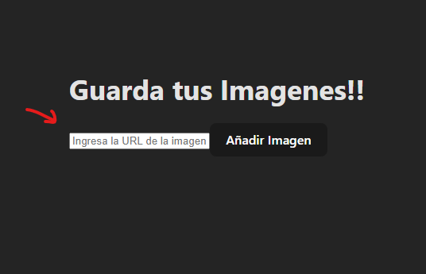
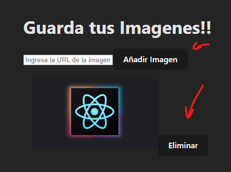

# PruebaTecnica-Td
Galeria de Imagenes
Diseñé una galeria de imagenes que permite añadir y eliminar

Biblioteca utlizada: React

Planteamiento
Primero cree la estructura, en donde reutilize el boton y algunos estilos de css que viene pre definidos al crear react mediante vite

Añadi usesState los cuales use para las funciones agregar y eliminar imagenes

Luego añadi las funcionalidades a los botones y mapie los dtos para que se mostraran al crear un imagen, puedes usar este link para añadir una imagen de react: https://www.patterns.dev/img/reactjs/react-logo@3x.svg

Herramientas Usadas: Github-Copilot
Autor: Lezcano Tirado Luis Ramon

